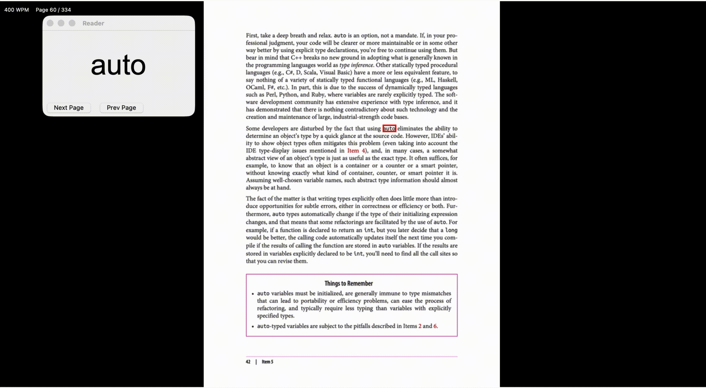

# pdfWordRunner



A simple PDF reader that displays each word in sequence using Rapid Serial Visual Presentation (RSVP).

**What it does:**
- **Displays words one-by-one:** The program extracts words from a PDF and shows them in a movable overlay window at a configurable words-per-minute (WPM).
- **Page preview + highlight:** The left side shows the rendered PDF page and draws a red rectangle around the currently displayed word.
- **Keyboard controls:** Pause/play and navigate while reading.

**Requirements**

Install the Python dependencies (recommended in a virtualenv):

```bash
python -m pip install -r requirements.txt
```

The project uses `pdfplumber` and `Pillow` (see `requirements.txt`).

**Quick start**

Run the reader with a PDF file:

```bash
python parser.py --file /path/to/file.pdf
```

Common options:

- `--file, -f` : Path to the PDF file (required).
- `--wpm` : Words per minute (positive integer). Default: `450`.
- `--font-size` : Base font size for the overlay (pixels). Default: `60`.
- `--fullscreen` : Start the main window fullscreen.
- `--start-paused` : Start paused.
- `--resolution` : Render DPI for PDF pages; higher gives crisper images. If omitted, DPI is chosen to make page width roughly match your screen.
- `--no-fit` : Do not scale pages to fit the window; show the rendered pixels with scrollbars.
- `--cache-size` : Number of rendered pages to keep in memory (LRU). Default: `16`.
- `--start-page` : Starting page (1-indexed). Default: `1`.
- `--end-page` : Ending page (1-indexed). Use `-1` for the last page. Default: `-1`.

**Controls**

- `Space`: Toggle pause / play.
- `Left` / `Right` arrows: When paused, step backward / forward by one word.
- `Escape`: Quit the application.
- Overlay window contains `Next Page` and `Prev Page` buttons for page-level navigation.

**Example commands**

Start reading at 350 WPM in fullscreen:

```bash
python parser.py -f document.pdf --wpm 350 --fullscreen
```

Start paused and show full-resolution pages (no fit):

```bash
python parser.py -f document.pdf --start-paused --no-fit --resolution 300
```

**Troubleshooting / tips**

- If the text extraction returns no words, the program will print a message and exit. Consider verifying the PDF has selectable text.
- For scanned PDFs without embedded text, OCR (outside the scope of this tool) is required before per-word extraction will work.
- If the highlight rectangle is misaligned, try increasing `--resolution` (DPI) to get crisper page images; the program attempts to estimate DPI automatically.
